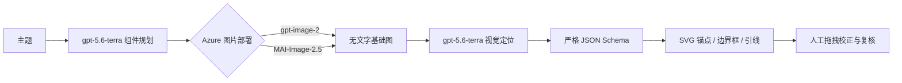

# Semantic Diagram PoC

这是一个把 AI 图像与可编辑空间语义层分开的端到端 PoC：



应用内置离线离心泵样例；没有 Azure 凭据也能体验部件选择、双向高亮、锚点拖拽、说明编辑、复核状态和 JSON 导出。真实调用只发生在服务端，浏览器不会收到 API key。用户只需输入主题；组件规划、无标签图片生成与空间标注会自动串联完成。

## 快速运行

```bash
npm install
cp .env.example .env.local
npm run dev
```

访问 `http://localhost:3000`。完整验证命令：

```bash
npm run check
```

## Azure 配置

环境变量中的模型值是你在 Azure 中创建的**部署名**，不要求和模型目录 ID 相同。

最小的 `gpt-image-2 + gpt-5.6-terra` 配置：

```dotenv
AZURE_OPENAI_ENDPOINT=https://YOUR-RESOURCE.openai.azure.com
AZURE_OPENAI_API_KEY=YOUR_KEY
AZURE_GPT_IMAGE_DEPLOYMENT=gpt-image-2
AZURE_VISION_DEPLOYMENT=gpt-5.6-terra
```

`MAI-Image-2.5` 使用不同的 Microsoft Foundry API，因此需要 `.services.ai.azure.com` 资源端点：

```dotenv
AZURE_MAI_IMAGE_ENDPOINT=https://YOUR-RESOURCE.services.ai.azure.com
AZURE_MAI_IMAGE_API_KEY=YOUR_KEY
AZURE_MAI_IMAGE_DEPLOYMENT=MAI-Image-2.5
```

图片部署和视觉部署可以位于不同资源；使用 `AZURE_GPT_IMAGE_*`、`AZURE_MAI_IMAGE_*`、`AZURE_VISION_*` 分别覆盖公共配置。视觉定位默认调用 Responses API；若某个部署只支持 Chat Completions，可设置：

```dotenv
AZURE_VISION_API=chat-completions
```

## 两个图片适配器

| 模型选择 | 服务端端点 | 主要请求参数 |
| --- | --- | --- |
| `gpt-image-2` | `/openai/v1/images/generations?api-version=preview` | `model`, `prompt`, `size`, `quality` |
| `MAI-Image-2.5` | `/mai/v1/images/generations` | `model`, `prompt`, `width`, `height` |

当前 Microsoft 文档将 `gpt-image-2` 标为 GA，将 `MAI-Image-2.5` 标为 Preview；MAI 当前文档还将输入语言列为 `en`。本 PoC 的固定控制指令使用英文，但中文主题和部件描述仍会原样出现在 brief 中。若用于生产，建议增加受控的中译英 prompt 编译步骤。

## 数据约定

`POST /api/plan` 会根据主题自动产生 4–9 个适合在同一张图中展示的组件。每个组件包含稳定 ID、英文名称和面向读者的说明，随后原样传递给图片生成与视觉定位阶段。

视觉模型返回每个部件的：

- `anchor`: 引线落点，`x/y` 均为 `0–1`。
- `box`: 可见区域的归一化边界框。
- `visible`: 无法确认时必须为 `false`，不会强行画错标记。
- `confidence` 与 `evidence`: 置信度和可审计的视觉依据。
- `reviewStatus`: `ai-draft`、`human-edited` 或 `approved`。

服务端会按原始部件 ID 重新对齐结果、丢弃额外部件、补齐缺失部件、裁剪越界坐标，并始终将模型结果置为 `ai-draft`。

## API

- `GET /api/status`：只返回配置状态和部署名，不返回密钥。
- `POST /api/plan`：仅根据主题自动推断图像类型与受众，并生成组件清单和视觉方向。
- `POST /api/generate`：根据规划结果生成图片，再用视觉模型定位，返回图片 data URL 与标注 JSON。

PoC 不持久化图片或标注。生产化时应把图片写入受控 Blob Storage，把 JSON 版本化存储，并增加身份验证、配额、内容安全审计、任务队列和多人审核。

## 质量与安全边界

- 图片模型可能生成结构错误；视觉模型也可能把“画出来的错误”精确定位。
- 医学解剖、设备维修和安全操作资料必须由相应专业人员审核。
- “已复核”在本 PoC 中只存在浏览器状态中，不代表平台认证。
- 图片以 base64 在两个模型之间传递，适合 PoC，不适合高并发生产流量。
- 生成提示明确禁止把名称、编号或引线烘焙进像素，便于国际化、无障碍和后续修改。

## 官方接口依据

- [Azure OpenAI v1 API](https://learn.microsoft.com/azure/foundry/openai/api-version-lifecycle)
- [Azure OpenAI Responses API](https://learn.microsoft.com/azure/foundry/openai/how-to/responses)
- [Azure OpenAI structured outputs](https://learn.microsoft.com/azure/foundry/openai/how-to/structured-outputs)
- [Azure OpenAI image generation models](https://learn.microsoft.com/azure/foundry/openai/how-to/dall-e)
- [MAI image models in Microsoft Foundry](https://learn.microsoft.com/azure/foundry/foundry-models/how-to/use-foundry-models-mai-image)
